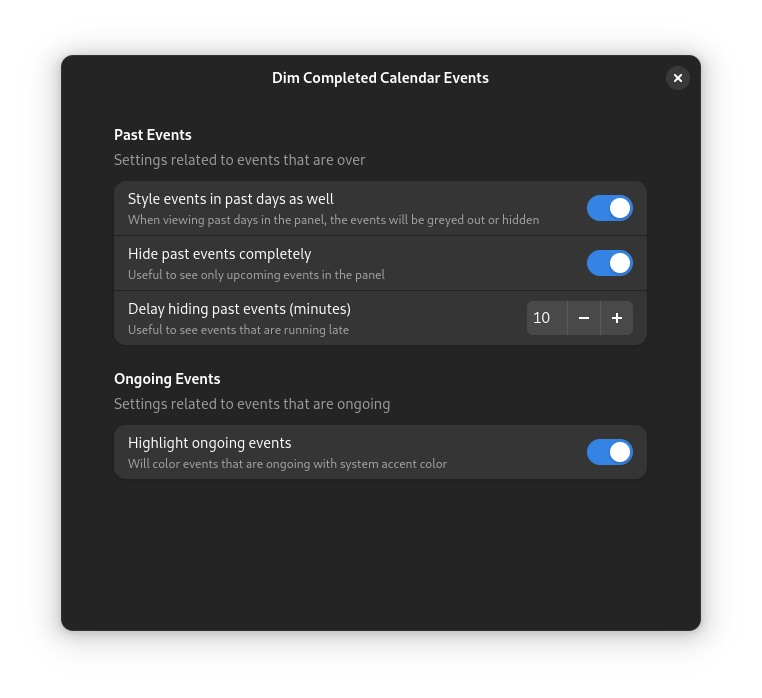

#  Dim Completed Calendar Events Gnome Extension

<a
href="https://extensions.gnome.org/extension/5979/dim-completed-calendar-events/">
 </a>

A Gnome extension that styles calendar events in the top panel to
make it clear which events are completed, ongoing, and upcoming.
The onoging events are colored to match the accent color selected in the system (Gnome 47 and up).


## Configuration

You are able to configure the following options:



## Contributing

In case of problems, it's a good idea to open an
[Issue](https://github.com/marcinjahn/gnome-dim-completed-calendar-events-extension/issues).
If you know how to fix it, open a [Pull
Request](https://github.com/marcinjahn/gnome-dim-completed-calendar-events-extension/pulls)!

### Local Development

To run the extension locally "from sources":

```
git clone git@github.com:marcinjahn/gnome-dim-completed-calendar-events-extension.git
cd gnome-dim-completed-calendar-events-extension
npm i
npm run build
npm run linkdist
```

The last command will creae a soft link at
`~/.local/share/gnome-shell/extensions/dim-completed-calendar-events@marcinjahn.com`,
which allows you to enable the extension on your system (e.g., via [Extensions
Manager](https://flathub.org/apps/com.mattjakeman.ExtensionManager)).

Anytime you change anything, rebuild the extension with `npm run build`, and
restart the session:

- on Wayland, log out and log in (I know, it's painful),
- on X11, open "Run a Command" dialog (Alt + F2), type "r" and press Enter
